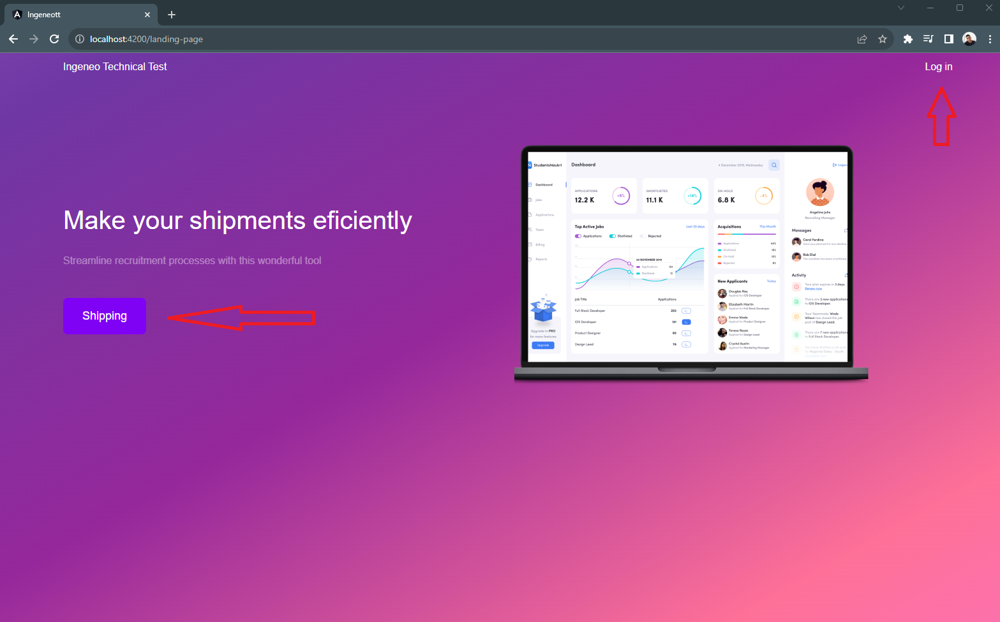

# IngeneoTechnicalTest

Sistema de logística marítima/terrestre y rastreo de envíos

## Tecnologías Utilizadas


- **Backend:** Java 11 - Spring Boot 2.7.17
- **Frontend:** Angular 14.2.13
- **Base de Datos:** PostgreSQL 15.4

## Definición de Buenas Prácticas

En este proyecto, se siguieron las siguientes buenas prácticas:

- **Principio SOLID:** Se aplicaron los principios SOLID para mantener un código modular y fácil de mantener.
- **Pruebas Unitarias:** Se escribieron pruebas unitarias para garantizar la calidad y confiabilidad del código.
- **Documentación:** Se documentó el código con Javadoc para el backend y siguiendo estándares con un estilo de codificación consistente para mejorar la legibilidad. Además de exponer los servicios en Swagger.
- **Seguridad:** Se implementó la seguridad de los servicios con Token tipo Bearer. Además las contraseñas de los usuarios se encriptaron con un Hash.

## Justificación de Tecnologías y Patrones de Diseño

- **PostgreSQL:** Se eligió PostgreSQL como base de datos debido a su robustez, escalabilidad y soporte para consultas complejas.
- **Java - Spring Boot:** Se utilizó Spring Boot debido a su facilidad de configuración y desarrollo rápido, lo que permite enfocarse en la lógica de negocio en lugar de la configuración del framework.
- **Angular:** Se optó por Angular para el frontend debido a su arquitectura de componentes, lo que facilita la creación de interfaces de usuario interactivas y dinámicas.
- **Control de versiones:** Se utilizó Github como repositorio y el estándar GIT-FLOW creando ramas main, develop, features/funcionalidades, bugfix/resolve-bugs y hotfix/cambios-directos-master.

## Navegación de la app




## Instalación

### Prerequisitos
- **Base de Datos** PostgreSQL
- **Java en versión 11 o superior**
- **npm Instalado**

Si tiene pgAdmin u otro cliente de PostgreSQL crear una base datos con el nombre **INGENEO_TECHNICAL_TEST**
El usuario y la password de PostgreSQL debe ser:

```bash
username=postgres
password=1010239900
```
En caso de querer cambiarla en Postgres también se debe cambiar en la ruta: **IngeneoTechnicalTest\ingeneo_technical_test\ingeneo_technical_test\src\main\resources\application.properties**
Las propiedades en el archivo son:
```bash
spring.datasource.username=postgres
spring.datasource.password=1010239900
```

Si decide crear la Base de Datos por consulta SQL sería de la siguiente forma:
```bash
CREATE DATABASE "INGENEO_TECHNICAL_TEST"
    WITH
    OWNER = postgres
    ENCODING = 'UTF8'
    CONNECTION LIMIT = -1
    IS_TEMPLATE = False;
```

#### Clona el repositorio
```bash
git clone https://github.com/johan2398/IngeneoTechnicalTest.git
```
#### Ubicarse en la ruta del proyecto frontend
```bash
cd IngeneoTechnicalTest/frontend/ingeneott
```
#### Instala las dependencias del frontend
```bash
npm install
```

#### Ejecutar la aplicación del frontend
```bash
start "Angular Server" ng serve --open
```
#### Ubicarse en la ruta del proyecto backend
```bash
cd ../../ingeneo_technical_test/ingeneo_technical_test
```

#### Construye el proyecto backend
```bash
mvn clean install
```
#### Ejecuta el servidor
```bash
java -jar target/ingeneo_technical_test-0.0.1-SNAPSHOT.jar
```
Cuando se haya culminado con éxito el proceso se desplegará el frontend por el puerto 4200 y el backend estará corriendo en el 8080.
En el cmd se deberá ver algo como esto:


## Covertura de pruebas

Se obtuvo una covertura del 80% en el análisis de Sonar
